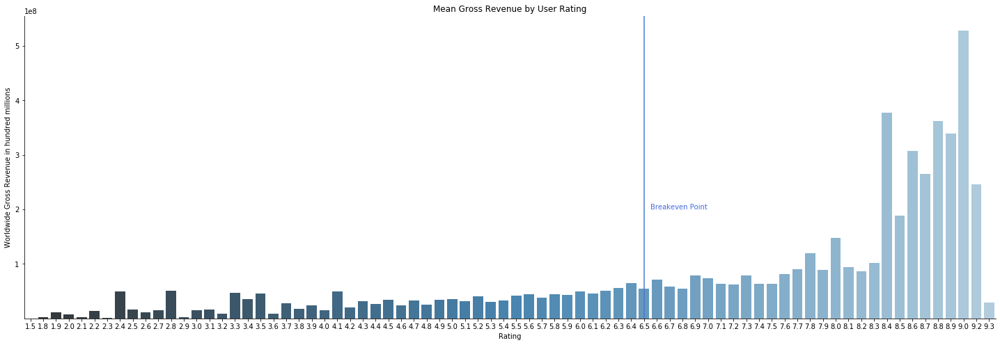

# Module 1 Final Project

Aren Carpenter & Albert Um
DS Cohort 06/22/20

## Introduction

In order to consult Microsoft in their endeavor to break into the movie business we used provided data and webscraped IMDB to draw useful insights and draft recommendations. Our webscraped data included budgets, USA and Worldwide gross earnings, and user ratings, in addition to other variables, to answer the following questions and guide Microsoft towards a profitable future and positive Return on Investment (ROI) in the film industry.

1) Is now even a good time to get into the film business? What is the state of the industry? 

2) What profits can be expected (revenue - budget)? 

Some caveats: how to increase the odds that your movie will be successful? 

3) How do user ratings (x out of 10) affect the earning potential of your movie?

4) What genre or combination of genres will provide the best ROI? 

### Files in the Repo

- Final.ipynb : our final submission, including data cleaning and visualizations separated by EDA for each question

- zippedData : in addition to provided data, houses our webscraped data separated by decade from IMDB

- IMDB_WebScraping.ipynb : notebook for webscraping code and writing csvs

- Individual_EDA_Notebooks : separate notebooks for each section of EDA, they have been concatenated into the Final.ipynb file

### Libraries to Import

- Matplotlib.pyplot & Seaborn          // Data Visualization
- Pandas & Numpy                       // Data Manipulation
- Requests & Beautiful Soup & JSON     // Webscraping
- Tdqm (optional)                      // Progress Bar

### Slide Deck

- Link : put link here
- In Repo : put file name here

## Methods

### Data Collection

In order to answer our question about budget versus revenue we need data outside of the provided datasets. We decided to scrape IMDB for budget, USA gross revenue, and worldwide gross revenue for this question. Additionally, we scraped each movie's user rating and rating population. For each year from 1960 to 2020, we scraped the top 300 most popular movies for a total of 18,300 datapoints. This process was conducted for each decade before joining these csvs into one dataset. 

See IMDB_WebScraping.ipynb for details.

### Data Cleaning

Individualized cleaning was conducted for each session of EDA. In general, we had to recast data from IMDB that was formatted as currency, e.g. $100,000, to a numeric datatype. This required stripping the '$' character and removing commas from dollar amounts. Additionally, there were a number of foreign films who reported earnings in local currencies. These non-USD amounts were removed but only accounted for 600 entries. 

Due to our concatenated datasets, we needed to reset the indexes and delete appropriate columns. 

## Visualizations and Insights

