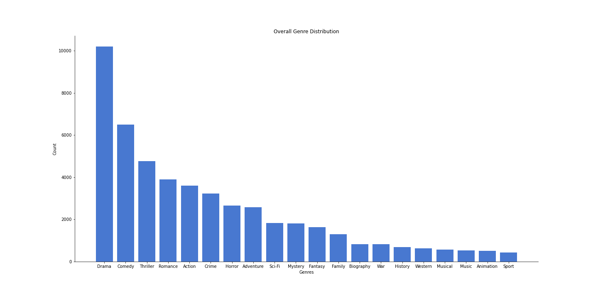

# A Step into the Movie Biz

Aren Carpenter & Albert Um
DS Cohort 06/22/20

## Introduction

In order to consult Microsoft in their endeavor to break into the movie business we used provided data and webscraped IMDB to draw useful insights and draft recommendations. Our webscraped data included budgets, USA and Worldwide gross earnings, and user ratings, in addition to other variables, to answer the following questions and guide Microsoft towards a profitable future and positive Return on Investment (ROI) in the film industry.

1) Is now even a good time to get into the film business? What is the state of the industry? 

2) What profits can be expected (revenue - budget)? 

Some caveats: how to increase the odds that your movie will be successful? 

3) How do user ratings (x out of 10) affect the earning potential of your movie?

4) What genre or combination of genres will provide the best ROI? 

## Repository Navigation

* **[000_IMDB_WebScraping.ipynb](000_IMDB_WebScraping.ipynb)**: Webscraping script using BeautifulSoup to scrape movie metadata from IMDB.

* **[010_EDA_Budget_vs_Revenue.ipynb](010_EDA_Budget_vs_Revenue.ipynb)**: EDA for movie budgets and revenues.

* **[011_EDA_Genres.ipynb](011_EDA_Genres.ipynb)**: EDA for movie genres.

* **[012_EDA_Ratings.ipynb](012_EDA_Ratings.ipynb)**: EDA for movie ratings.

* **[013_EDA_Revenue_over_Time.ipynb](013_EDA_Revenue_over_Time.ipynb)**: EDA for movie revenue over time.

* **[020_Final_Compilation.ipynb](020_Final_Compilation.ipynb)**: A final version compiling all EDA work into one presentation.

### Slide Deck

* [Google Slides](https://docs.google.com/presentation/d/1tMjre-J1QTPLXF2Mo4Nts5N8BN6wqDG72K3n6s3pZBY/)
* [In Repo](presentation.pdf)

## Methods

### Data Collection

In order to answer our question about budget versus revenue we need data outside of the provided datasets. We decided to scrape IMDB for budget, USA gross revenue, and worldwide gross revenue for this question. Additionally, we scraped each movie's user rating and rating population. For each year from 1960 to 2020, we scraped the top 300 most popular movies for a total of 18,300 datapoints. This process was conducted for each decade before joining these csvs into one dataset. 

### Data Cleaning

Individualized cleaning was conducted for each session of EDA. In general, we had to recast data from IMDB that was formatted as currency, e.g. $100,000, to a numeric datatype. This required stripping the '$' character and removing commas from dollar amounts. Additionally, there were a number of foreign films who reported earnings in local currencies. These non-USD amounts were removed but only accounted for 600 entries. 

Due to our concatenated datasets, we needed to reset the indexes and delete appropriate columns. 

## Visualizations and Insights

### Revenue over Time

To answer our first question, should Microsoft even be considering entering the crowded film industry? Let's look at the potential earnings in the last 80 years. The total revenue has grown exponentially throughout the history of film as movies became a more widely accepted and popular mass media. In the last twenty years, the summer blockbuster and holiday seasons have led to movies earning billions at the box office. Despite the heavy competition, Microsoft's name recognition and resources leave it particularly well suited to enter this industry. 

### Budget vs Revenue: What are the actual profits?

While we can see that there is a tremendous earning potential in the film industry, it is very expensive to create movies. So how do these costs affect the actual profit (revenue - budget) that can be expected when creating a film. 

Perhaps not unexpectedly, there is a positive relationship between budget and worldwide gross revenue. For example, a movie with budget 150 million dollars would expect to return approxiamtely 500 million dollars in revenue, and 350 million dollars in profit. However, simply increasing the budget ignores the many, varied factors that impact the feasibility and profitability of a film.

Many films with budgets of less than 50 million dollars lose money. And some, like Avatar or Star Wars make more than 2.5 billion dollars with budgets of 250 and 350 million dollars, respectively. And as we can see from the jointplot's bivariate distributions, the majority of movies make less than 100 million dollars in revenue. 

### Rating Distribution: 

So let's look at some of the factors that can affect a movie's earnings. For example, its reception by the audience. 

By plotting the distribution of user ratings we see that the mean rating is 6.2. This is just below our calculated breakeven point, the average rating of movies who make a profit, rating of 6.5. There is also a slight negative skew to our distribution. This could be because audience members are more likely to log in to IMDB to rate a movie they didn't like or they are less willing to give a movie a score greater than a 9. 

### Rating vs Revenue: 

Let's see how these ratings relate to a movie's gross revenue. We can see that movies with higher ratings earn more money. On average, movies with a rating above our breakeven point made a profit, while those below did not. And while we do not have an objective way to measure a movie's subjective quality, we can assume that low user ratings equate to poor quality movies and thus less revenue. 

### Genres and Revenue:

We see that Dramas are the most prolific genre throughout the history of film with more than 10,000 entries out of our 18,000 movies sampled. Comedy is second with about 1/3 of movies using this tag. This should not be unexpected as drama and comedies are over-arching genres, that is other genres can be easily paired with these, i.e. Romantic Comedies or Historical Dramas. However, tastes change, so let's look at what genres have been on the rise and those who are falling from popularity. 

Because movies can have multiple genre tags, our legend shows "Has [Genre]" and that selection includes all movies that contain that tag. These are the four fastest growing genres defined by the slope of their popularity over time. We would predict that movies utilizing one or more of these genres could capitalize on the current state of the film industry and have the greatest return on investment and please audiences. 

## Key Insights and Recommendations

While movies with a larger budget are more likely to earn more revenue, that budget should be allocated to ensure that a movie is highly rated. On average, only movies that earned an 8.5 user rating or greater earned more than 200 million dollars.

Achieving a high user rating is important for earning high revenue and having long-term success. One way to please audiences is to create a film that utilizes popular genres. We identified Animation, Adventure, Musical, and Fantasy as the fastest growing genres. No wonder Pixar Studios and Disney have been two of the highest grossing studios. For example, Disney's "Tangled" and Pixar's "Coco" are tagged as all four of those genres and have been very successful and well rated by audiences.  

We recommend not making a Drama. While Drama has historically been the most numerous genre, with 10,000 entries of our 18,000 movies sampled, it is one of the four fastest declining genres according to revenue. In general, Dramas do not easily lend themselves to becoming summer blockbusters, though they can have greater staying power than other genres.

## Future Directions

While we have provided a framework for Microsoft's initial entry into the film industry, we have more expansive topics to explore if brought on full-time.

Some examples include:

1) "The Total Package" : in addition to the recommendations stated above, what is the ideal combination of principal actors, director, screenwriter, director of photography, composer, MPAA rating, time of release, etc. Let us min/max the hiring and creative decision process to ensure the greatest return on investment.

2) "The Cult Classic" : what makes a long-term success? We know of these movies that, despite box office flops upon release, have become cultural icons, for example "The Room", "Rocky Horror", "Donnie Darko", and "Blade Runner". These movies easily become profitable in the long term. But what factors make a cult classic? 

3) "The Perfect Advert" : using Natural Language Processing paired with the efficient and effective trailer making process currently employed by the film industry, how can we create the perfect pitch, the perfect trailer, and the perfect synposis that will have audiences interested in the movie. 